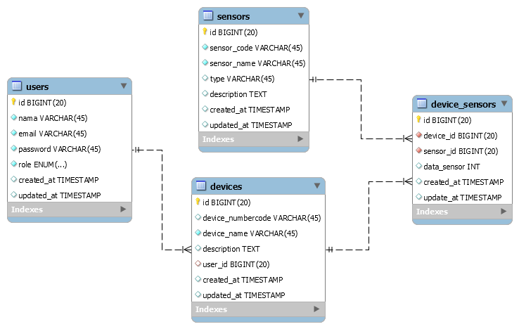

    Requirements <a href="https://www.php.net/downloads.php"><b>PHP >= 7.3.0</b></a>

## Deployment

`composer update` 
copy `.env.example` kemudian rename menjadi `.env` 
atur database: 
`DB_DATABASE=app_iot
DB_USERNAME={nama username database di komputer}
DB_PASSWORD={password database di komputer}` 

buat database bernama <b>app_iot</b> 

`php artisan key:generate` 
`php artisan migrate --seed` 
`php artisan serve` 
jalankan http://127.0.0.1:8000/ di browser 

login admin: 
email : `admin@email.com` 
password : `admin123` 

login user biasa: 
email : `user@email.com` 
password : `user123` 

**ENDPOINTS data sensor**

Method `GET`  
Endpoints `http://localhost:{port}/api/v1/device_sensor?data_sensor={nilai_data_sensor}&device_id={device_id}&sensor_id={sensor_id}`

### ERD:

